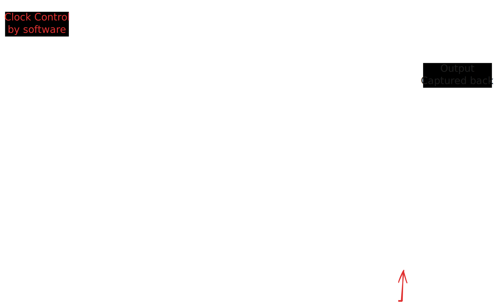

# Speed Testing

This project has a somewhat more complex structure than the others.  The core idea, however, is very simple, and it is strongly suggested that you treat the project as more or less a black box to start with, and modify only the core DUT module.  Currently this module is in the file `mult.v` - you can change the functionality inside this module to anything else you would like, but right now the following assumptions are made:

- the design inside `mult.v` is a combinational logic block
- it takes two inputs `a` and `b` of 32 bits each, and generates one output of 32 bits `c`.

## Idea behind timing test

Every combinational circuit (for example a multipler) has a certain critical path, which determines the maximum frequency at which inputs can be fed to it (max frequency is inversely proportional to critical path).  So if we want to check if a combinational component can operate at a given speed, we put registers in front of it and after it, feed data into the input registers (*launch*) and latch them into the output registers (*capture*). If we can change the clock period and repeat this process, we can test the maximum speed at which the circuit can operate.

In our case, we use the [Pynq](https://pynq.io) software framework for this. Our FPGA has an ARM processor that runs Linux, and the Pynq project has already taken up the hard task of providing us a mechanism where we can write and read registers from the CPU, as well as control the clock signal sent into the FPGA fabric.  The details of how this works are out of scope of this lab.



The figure shows the approximate setup. The details of how exactly the registers are made and connected, and how the software can tweak the inputs, collect the outputs, and change the clock, are all in the Python notebook provided with this exercise. Knowing how this works is not mandatory for this exercise, but we strongly encourage you to experiment. This is something that can only be done when you have access to a board with Pynq.

## Procedure

### Modify DUT

You can modify the code inside `mult.v` if needed.  Right now it just implements a simple multiplication - this will normally get synthesized using the DSP blocks inside the FPGA.  It is given as a basic demo.

### Compile the bit file

This assumes you have Vivado 2021.1 installed and are running on a Linux like system.  Note that it should also work on Windows but has not been tested.

Run the command 

```sh
vivado -mode batch -source ./proj.tcl
```

inside the `scripts/` directory.  It will take about 10 minutes to synthesize, after which you will find two files in the `build/vivado` directory:

- `speed_test.bit`
- `speed_test.hwh`

### Running the test

- Connect a Pynq-Z1 board to power and ethernet.  Ensure it is set to SD card mode so that it boots the regular Pynq image.  It may take time to load up, but eventually you should be able to connect to the IP address of the board.
  - Note that identifying the IP address of the board is dependent on how you have connected the board: please refer to the Pynq documentation for suggestions on how you can do this.
- Connect to the Jupyter interface on the Pynq board.  The default password in most cases is `xilinx` but you may need to check for the board assigned to you.
- Upload the files:
  - `speed_test.bit`
  - `speed_test.hwh`
  - `mult_speed.ipynb`
- Open the file `mult_speed.ipynb`.  This is a Python notebook.
- Run the code one cell at a time.  At the end, you should see a message saying there were 0 errors.
- Modify the line `Clocks.fclk1_mhz=100` to set some other frequency, for example 250 MHz.  Rerun the code and see if there are errors.

## Marks

This is a standard demo test to illustrate speed testing and some slightly more advanced scripting with TCL.  The main demo to be shown is fairly straightforward.

Some suggestions for seeing timing failures:

- Find the maximum operating speed of an adder
- Implement a multiplier using the parallel array multiplier or Booth multiplier approaches (remember it must be combinational)
- Implement a function like `a*a + b*b` and see at what frequency it fails.


